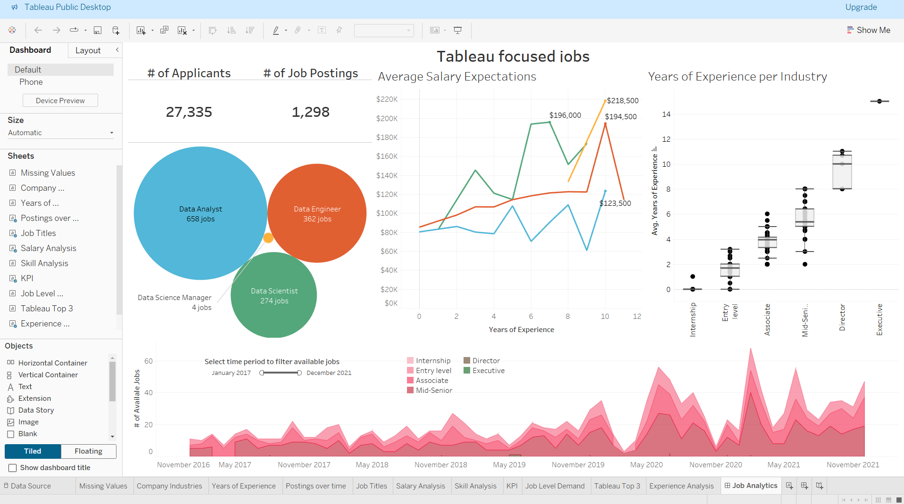

# Job-Market
This project provides an in-depth analysis of the job market using interactive Tableau dashboards.
The visualizations offer insights into job availability, salary ranges, employment rates, and market dynamics, helping job seekers, recruiters, and policymakers make informed decisions.

Key Features:

  - Interactive dashboards illustrating job openings, industry trends, and skill demands.
  - Visual analysis of salary distributions, employment rates, and job growth patterns.
  - Filtering options for exploring specific industries, job roles, or geographic areas.
  - Dynamic visuals to understand market shifts and identify emerging job opportunities.
  
Ideal for recruiters, job seekers, career counselors, and market analysts to navigate and understand the current job landscape effectively.

Check out the [Job Market Analysis Project](https://m97khaled.github.io/Job-Market/) on Tableau Public.

